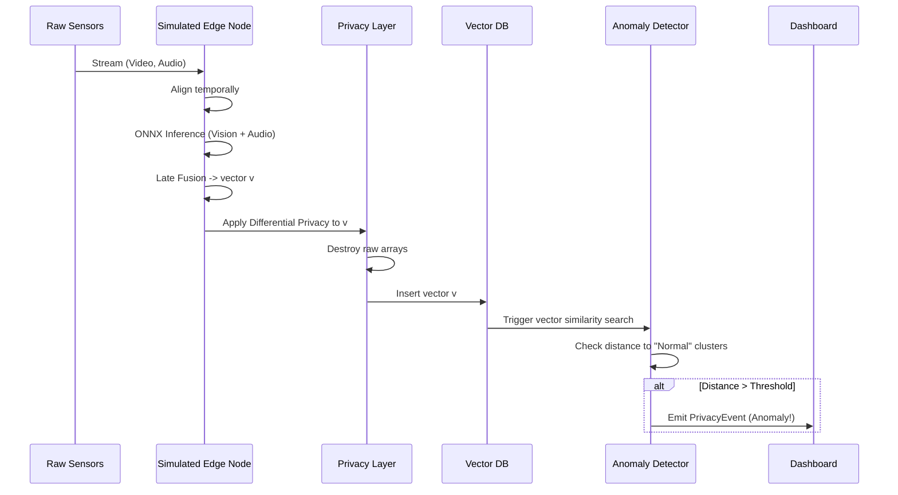

# Kizuna Multimodal Privacy Engine — Technical Architecture

> **Version:** 1.0  
> **Last updated:** 2026-06-11  
> **Language / Runtime:** Python 3.10+ · C++ (pybind11) · ONNX Runtime · Qdrant / FAISS  
> **Architecture style:** Simulated edge-containerized multimodal embedding pipeline with zero-knowledge privacy enforcement  

---

### Thesis Statement

> This architecture defines the Kizuna Multimodal Privacy Engine, a platform designed to create a unified multimodal embedding space for privacy-preserving anomaly detection. Tailored for Japan's super-aging society, it aggregates simulated video, audio, motion, and environmental sensor data at the edge. By converting all raw sensor streams strictly into compressed, anonymized vector embeddings prior to any centralized processing, the system ensures compliance with APPI regulations while enabling zero-shot and few-shot cross-domain anomaly detection (e.g., elderly falls, crowd congestion).

### Core Research Question

> How can disparate edge sensor modalities (video, audio, environmental, motion) be fused into a unified embedding space under severe edge-compute constraints (simulated via Docker) to accurately detect societal anomalies without persisting any personally identifiable information (PII)?

### Core Contributions

1. **(C1)** Design of a **Unified Cross-Domain Embedding Space** combining video, audio, and sensor readings for homogeneous anomaly querying.
2. **(C2)** Enforcement of **Absolute Privacy via Embedding-Only Outputs**, preventing raw data from leaving the local simulated edge node and introducing differential privacy at the vector level.
3. **(C3)** A deployable, **software-simulated Edge Architecture** using Docker Compose to strictly throttle CPU/Memory and benchmark models using ONNX Runtime.

---

## Table of Contents

1. [System Overview](#1-system-overview)  
2. [Architecture Breakdown](#2-architecture-breakdown)  
3. [Related Work & Positioning](#3-related-work--positioning)  
4. [Domain Model](#4-domain-model)  
5. [Execution Flow](#5-execution-flow)  
6. [Multimodal Embedding Engine](#6-multimodal-embedding-engine)  
7. [Vector Database & Anomaly Search](#7-vector-database--anomaly-search)  
8. [Privacy & APPI Compliance Layer](#8-privacy--appi-compliance-layer)  
9. [Edge Simulation & Resource Constraints](#9-edge-simulation--resource-constraints)  
10. [Deployment & Developer Workflow](#10-deployment--developer-workflow)  

---

## 1. System Overview

### Purpose

Kizuna is built for real-time intelligence in environments sensitive to privacy, such as nursing facilities, railway stations, and smart buildings. It processes raw multimodal inputs locally, converting them to dense vector embeddings. Only these embeddings, alongside high-level abstract event triggers (`{"event": "fall_risk", "confidence": 0.94}`), are transmitted or persisted. 

The core innovations are:
1. **Containerized Edge Nodes** — Software-simulated constraints to mimic Jetson Nano or Raspberry Pi limits.
2. **Multimodal Fused Embeddings** — Leveraging ONNX-optimized models (like CLIP, Jina Embeddings) to map different modalities into a single semantic space.
3. **Local Vector Search** — Using Qdrant/FAISS for rapid similarity lookups to flag anomalies based on proximity to known baseline clusters.

### High-Level Architecture

```mermaid
flowchart TB
    subgraph EdgeNode ["Simulated Edge Node (Docker throttled CPU/RAM)"]
        subgraph Sensors ["Raw Data Ingestion"]
            VID[Video Stream]
            AUD[Audio Stream]
            MOT[Motion/Env Sensors]
        end

        subgraph Preprocessing ["Local Preprocessing"]
            VPRE[Frame Extraction]
            APRE[Audio Spectrogram]
            MPRE[Sensor Time-Series]
        end

        subgraph Embedding ["Embedding Engine (ONNX)"]
            VMOD[Vision Model<br/>e.g., CLIP-Vision]
            AMOD[Audio Model<br/>e.g., AudioCLIP]
            MMOD[Sensor MLP]
            FUSE[Multimodal Fusion<br/>& Quantization]
        end

        subgraph Privacy ["Privacy Layer"]
            DP[Differential Privacy<br/>Noise Addition]
            WIPE[Raw Data Destruction]
        end

        Sensors --> Preprocessing
        Preprocessing --> Embedding
        Embedding --> FUSE
        FUSE --> DP
        DP --> WIPE
    end

    subgraph CentralSystem ["Central Aggregation & Analytics (Cloud / On-Prem)"]
        VDB[(Vector DB<br/>Qdrant/FAISS)]
        ANOM[Anomaly Detection Layer<br/>(KNN / Density Search)]
        DASH[Streamlit/Gradio<br/>Dashboard]
    end

    WIPE -- "Anonymized Embeddings Only" --> VDB
    VDB --> ANOM
    ANOM --> DASH
```

### Core Responsibilities

| Responsibility | Owner |
|---|---|
| Ingest raw multimodal streams | Edge Sensor Interface |
| Convert raw inputs to unified vector embeddings | ONNX Multimodal Embedding Engine |
| Apply differential privacy and destroy raw data | Privacy Layer |
| Store and index unified vectors | Vector DB (Qdrant/FAISS) |
| Compare vectors against anomaly baselines | Anomaly Detection Layer |
| Provide interactive visual feedback (sans PII) | Streamlit / Gradio Dashboard |
| Restrict compute resources for edge testing | Docker Compose Simulator |

---

## 2. Architecture Breakdown

### 2.1 Multimodal Ingestion Layer

Simulates ingestion from various sensor types. Implements backpressure and temporal alignment to ensure video frames and audio samples correlate to the exact same time step.

### 2.2 Local Embedding & Fusion Engine (`src/engine.py`)

Takes temporally aligned inputs and processes them via PyTorch models exported to ONNX. 
- **Vision**: Light-weight vision transformers or CNNs (e.g., MobileCLIP).
- **Audio**: Lightweight audio models (e.g., Audio Spectrogram Transformer).
- **Fusion**: Late-fusion projection heads that map all modalities into a single $D$-dimensional vector space.

### 2.3 Vector Database Layer (`src/database.py`)

A local or centralized Qdrant instance. It indexes the $D$-dimensional vectors. It relies heavily on HNSW (Hierarchical Navigable Small World) graphs for real-time similarity search.

### 2.4 Anomaly Detection (`src/anomaly.py`)

Instead of standard classification, anomalies are detected via geometric distances. 
- **Few-shot matching**: Is this vector close to a known "Elderly Fall" cluster?
- **Outlier detection**: Is this vector suspiciously far from the "Normal Activity" cluster?

### 2.5 Privacy Enforcer (`src/privacy.py`)

Ensures strict compliance with APPI:
- Guarantees vectors cannot be easily inverted to raw frames.
- Can optionally inject bounded Laplacian/Gaussian noise (Differential Privacy) into the embedding vector.
- Nullifies raw memory buffers explicitly in C++ using `pybind11` hooks to prevent memory scraping.

---

## 3. Domain Model

### Key Entities

#### SensorPayload
The raw temporal slice of incoming data. Destroyed immediately after embedding.
```python
@dataclass
class SensorPayload:
    timestamp: float
    camera_id: str
    video_frame: Optional[np.ndarray]   # (H, W, 3)
    audio_chunk: Optional[np.ndarray]   # 1 sec audio waveform
    env_data: Optional[Dict[str, float]] # e.g., {"temperature": 22.1, "motion": 1}
```

#### UnifiedEmbedding
The sanitized, encrypted output that represents the `SensorPayload`.
```python
@dataclass
class UnifiedEmbedding:
    timestamp: float
    source_node_id: str
    vector: np.ndarray                  # Shape (D,) e.g., 512 dimensions
    modalities_fused: List[str]         # e.g., ["video", "audio"]
    quantization_level: str             # e.g., "INT8"
    dp_epsilon: Optional[float]         # Differential privacy budget used
```

#### PrivacyEvent
An actionable anomaly trigger derived purely from the vector space.
```python
@dataclass
class PrivacyEvent:
    timestamp: float
    event_type: str                     # "fall_risk", "congestion_alert"
    confidence: float                   # Distance-based score
    embedding_reference_id: str         # UUID pointing to Qdrant payload
```

---

## 4. Execution Flow

### Pipeline (Steady State)



---

## 5. Edge Simulation & Resource Constraints

To prove the system works on edge devices without requiring physical hardware, Kizuna uses Docker-based resource throttling.

**Configuration (`docker-compose.yml`)**:
```yaml
services:
  kizuna-edge-node:
    build: .
    deploy:
      resources:
        limits:
          cpus: '2.0'          # Limit to 2 CPU cores
          memory: 2G           # Limit to 2GB RAM
    environment:
      - ONNX_EXECUTION_PROVIDER=CPUExecutionProvider
      - QUANTIZATION=INT8
```

This forces the development of highly optimized, quantized ONNX models and careful memory management (managed via pybind11) to avoid OOM crashes during video/audio processing.

---

## 6. Privacy & APPI Compliance Layer

Japan's Act on the Protection of Personal Information (APPI) is strict regarding biometric and behavioral data. Kizuna complies through:

1. **Irreversibility**: A neural network embedding (especially when quantized to INT8 and augmented with DP noise) cannot mathematically be perfectly inverted back to the original facial features or voice.
2. **No Persistence**: The raw `SensorPayload` never touches a disk. It resides entirely in volatile RAM and is explicitly overwritten once the `UnifiedEmbedding` is generated.
3. **Differential Privacy (DP)**: By adding calibrated noise to the output vector, individual identity contribution is masked while broad semantic meaning (e.g., "a person is falling") remains intact.

---

## 7. Development & Deployment

### Tech Stack
- **Core Engine**: Python 3.10
- **Performance Critical Modules**: C++ with `pybind11`
- **Models**: ONNX Runtime (CPU/INT8 for edge, CUDA for central evaluation)
- **Vector DB**: Qdrant
- **Dashboard**: Streamlit
- **Simulation**: Docker Compose

### Repository Structure (Target)
```text
kizuna-privacy-engine/
├── src/
│   ├── ingestion/       # Sensor simulators
│   ├── engine/          # ONNX embedding execution
│   ├── privacy/         # DP noise & memory wiping
│   ├── database/        # Qdrant integration
│   └── anomaly/         # Vector-based anomaly detection
├── models/              # Exported ONNX models (.onnx)
├── tests/               # Unit and performance limits tests
├── docker-compose.yml   # Edge simulation setup
└── app/                 # Streamlit Dashboard
```
